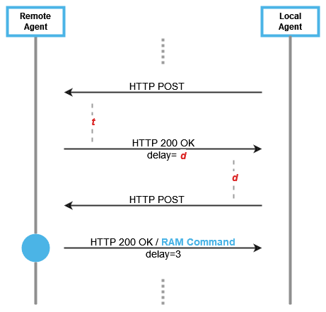

GP SERAM - HTTP REST Binding
============================

This file details the *HTTP REST Binding* which uses *HTTPS*
as *Transport* protocol layer and *JSON* as *Data Format* protocol layer.

The *Local Agent* acts as a HTTP client and the *Remote Agent* as a HTTP
server. Each GP SERAM *Message* may be transmitted in exactly one HTTP
message or may be aggregated with other Messages using a *Message
Pipelining* during the *Remote Management Step* as described below.

The formal API specification of the *HTTP REST Binding* is provided in
[OpenAPI format](/spec/gpseram.yaml). This specification file may be used to
generate code skeleton.

The *HTTP REST Binding* SHALL comply with:
- [RFC2818 – HTTP Over TLS](https://www.rfc-editor.org/rfc/rfc2818)
- [RFC6265 – HTTP State Management Mechanism](https://www.rfc-editor.org/rfc/rfc6265)
- [RFC7230 – Hypertext Transfer Protocol (HTTP/1.1): Message Syntax and Routing](https://www.rfc-editor.org/rfc/rfc7230)
- [RFC7231 – Hypertext Transfer Protocol (HTTP/1.1): Semantics and Content](https://www.rfc-editor.org/rfc/rfc7231)
- [RFC7232 – Hypertext Transfer Protocol (HTTP/1.1): Conditional Requests](https://www.rfc-editor.org/rfc/rfc7232)
- [RFC7234 – Hypertext Transfer Protocol (HTTP/1.1): Caching](https://www.rfc-editor.org/rfc/rfc7234)

Management Session and HTTP messages
------------------------------------

HTTP messages are attached with a *Management Session* based on the
*sessionId*. The *sessionId* is explicitly inserted in each HTTP request and
implicitly determined for HTTP response based on the client-server
paradigm of the HTTP protocol.

Implementors MAY uses another HTTP mechanism to reinforce the HTTP
session (e.g. HTTP cookies). A *Local Agent* SHOULD support HTTP cookies as
defined in [RFC6265](https://www.rfc-editor.org/rfc/rfc6265) .

HTTP Polling
------------

To allow the *Remote Agent* to send its *Command Messages* to the *Local
Agent*, an HTTP polling is used as server-push mechanisms.

During HTTP polling, some void HTTP messages MAY be used. A void HTTP
message is an HTTP message which doesn’t carry any *Command* or *Response
Message*, and which role is to maintain the communication channel between
the *Remote Agent* and the *Local Agent*.

The *Local Agent* SHALL uses HTTP polling whenever awaiting a *Command
Message*. It SHALL NOT use HTTP polling whenever it’s processing the
previous *Command Message* unless the last *Command Messages* doesn’t
require a *Response Message*.

The *Remote Agent* may fine-tune the HTTP polling by controlling the delay
between an HTTP response and the next HTTP request. If the *Remote Agent*
doesn’t specify any delay, the *Local Agent* SHALL make a pause of 1
second before sending the next HTTP request. The *Remote Agent* MAY used a
value of 0 to deactivate the delay.

As describes in [RFC6202](https://www.rfc-editor.org/rfc/rfc6202.html),
the *Remote Agent* MAY use HTTP long polling mechanism and wait a certain
period of time before sending the void HTTP response. *Remote Agent* SHOULD
NOT used period of time beyond 30 seconds and *Local Agent* SHOULD at least
support latency of 30 seconds between HTTP request and HTTP response.

Message Pipelining
------------------

The *Message Pipelining* allows multiple *Message Commands* to be sent over
a single HTTP response. An HTTP server MAY use *Message Pipelining*. An
HTTP client SHALL support *Message Pipelining*. It SHALL handle each
*Message Commands* one by one and the corresponding *Message Responses*, if
any, SHALL be included in the next HTTP polling request. The HTTP client MAY
merge some *Message Response* (e.g. all RAPDU may be sent in one *Message
Response*). The HTTP server SHALL support merged *Message Response*

If a *Local Agent* detect an error during the processing of a *Message
Command*, it SHALL discard all the remaining *Message Commands* and only
consider *Message Response* until the *Command Message* that raises the
error.

The *Message Pipelining* is only available during the *Remote Management
Step*.

HTTP REST Endpoints
-------------------

Two endpoints are defined: one to make the *Handshakes Step* and the
second to makes the *Remote Management Step*.

| **Endpoint**      | **Description**        |
|-------------------|------------------------|
| /handshake        | Handshake Step         |
| /remoteManagement | Remote Management Step |

Binding of the Handshake Step
-----------------------------

The Handshake Command SHALL be mapped to a HTTP POST request and the
associated Handshake Response to the associated HTTP Response.

JSON schema for the HTTP request and response during *Handshake Step* SHALL
fullfill the [GP SERAM OpenAPI specification](/spec/gpseram.yaml).

Binding of the Remote Management
--------------------------------

During the Remote Management step, the HTTP client SHALL poll the
server. The poll request SHALL be an HTTP POST message that contains the
*sessionId* and the status of the HTTP client.

Whenever some *Response Message* shall be sent to the HTTP server, the
HTTP client SHALL add them to the polling request.

The HTTP responses from the HTTP server SHALL included a JSON that MAY contains:
- a polling delay
- a list of *RAM Command*

The JSON schema for the HTTP request and response during *Remote management
Step* SHALL fullfill the [GP SERAM OpenAPI specification](/spec/gpseram.yaml).

Transmission Errors
-------------------

The *Local Agent* and the *Remote Agent* relies on HTTP protocol to their
exchanges. Most of the transmission errors will be transparently resumed
by the TCP (Transmission Control Protocol) end-to-end stack.

Nevertheless, some errors are unrecoverable at TCP level. This section
lists the rules a *Local Agent* and *Remote Agent* shall follow to enforce the
*Message* delivery or error detection.

Errors may result in a failure on each level of the exchanges:

-   the *Local Agent*

-   the *Remote Agent*

-   the *Device*

-   the *Remote Management Platform*

-   the network

If the HTTPS connection is prematurely closed, the *Local Agent* SHOULD
immediately try to re-establish the HTTPS connection with the *Remote
Agent*.

If the *Local Agent* could not establish an HTTPS connection or send an
HTTP request to the *Remote Agent*, it SHOULD retry during 5 minutes at
the most.

If the *Local Agent* doesn’t receive an HTTP response within a 40 seconds
delay from the *Remote Agent*, it SHOULD close the current HTTPS
connection and try to re-establish a new one.

If a *Remote Agent* could not send an HTTP response to a *Local Agent*
within a 30 seconds delay, it SHALL close the current HTTPS connection
and SHOULD await the *Local Agent* reconnection.

A *Remote Agent* SHOULD consider having lost a *Local Agent* after a
5-minute delay.

