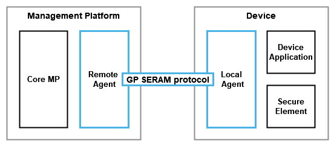
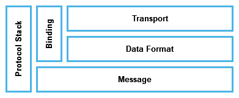
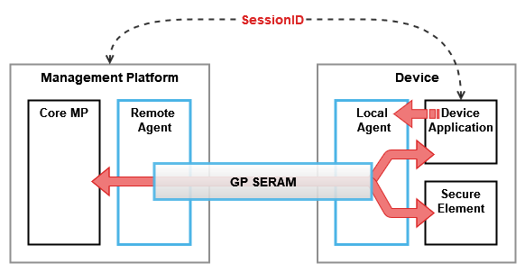
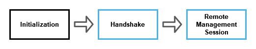
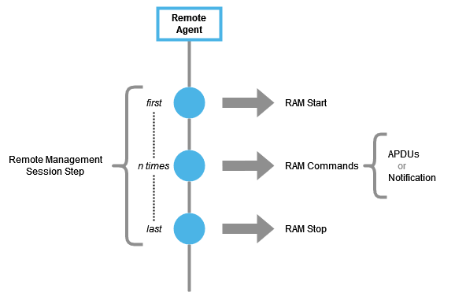
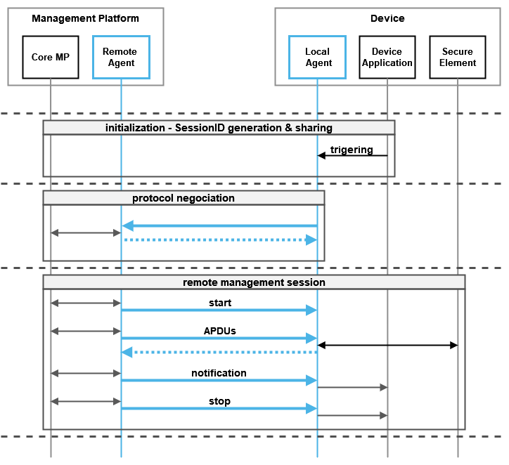
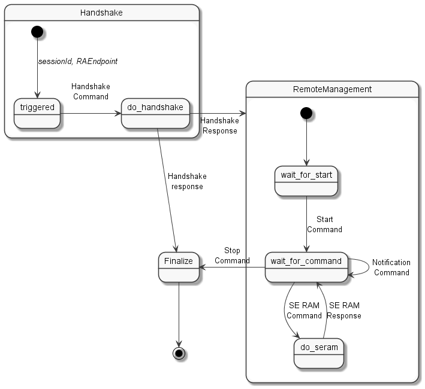

GP SERAM - Protocol Overview
============================

This specification defined a protocol that allows a [Device Application](GPSERAM__TerminologyAndDefinitions.md#DeviceApplication) to request the management of a [Secure Element](GPSERAM__TerminologyAndDefinitions.md#SecureElement) by a [Management Platform](GPSERAM__TerminologyAndDefinitions.md#ManagementPlatform).

The following figure present the generic architecture of GP SERAM and its environment. All part in blue is defined in this specification.

In this architecture, a [Remote Agent](GPSERAM__TerminologyAndDefinitions.md#RemoteAgent) and a [Local Agent](GPSERAM__TerminologyAndDefinitions.md#LocalAgent) manage the protocol to allow the [Management Platform](GPSERAM__TerminologyAndDefinitions.md#ManagementPlatform) to interact with a [Device Application](GPSERAM__TerminologyAndDefinitions.md#DeviceApplication) and the [Secure Element](GPSERAM__TerminologyAndDefinitions.md#SecureElement).

While [Management Platform](GPSERAM__TerminologyAndDefinitions.md#ManagementPlatform), [Device](GPSERAM__TerminologyAndDefinitions.md#Device) and [Secure Element](GPSERAM__TerminologyAndDefinitions.md#SecureElement) are physical entities, the [Device Application](GPSERAM__TerminologyAndDefinitions.md#DeviceApplication) and [Core Management Platform](GPSERAM__TerminologyAndDefinitions.md#CoreManagementPlatform) are logical components, and the [Remote Agent](GPSERAM__TerminologyAndDefinitions.md#RemoteAgent) and the [Local Agent](GPSERAM__TerminologyAndDefinitions.md#LocalAgent) in this specification are to be considered as functions. These functions might be implemented as standalone applications or as libraries integrated inside larger business applications. In the GP SERAM context, the terms [Remote Agent](GPSERAM__TerminologyAndDefinitions.md#RemoteAgent) and [Local Agent](GPSERAM__TerminologyAndDefinitions.md#LocalAgent) may be used interchangeably with *Remote Agent function* and *Local Agent function*.

Note that if the [Device](GPSERAM__TerminologyAndDefinitions.md#Device) embeds a [Trusted Execution Environment](GPSERAM__TerminologyAndDefinitions.md#TrustedExecutionEnvironment), the [Local Agent](GPSERAM__TerminologyAndDefinitions.md#LocalAgent) may be implemented in this [Trusted Execution Environment](GPSERAM__TerminologyAndDefinitions.md#TrustedExecutionEnvironment).  Otherwise, the [Local Agent](GPSERAM__TerminologyAndDefinitions.md#LocalAgent) is implemented in the [Rich Execution Environment](GPSERAM__TerminologyAndDefinitions.md#RichExecutionEnvironment) of the [Device](GPSERAM__TerminologyAndDefinitions.md#Device). In these two cases, the [Local Agent](GPSERAM__TerminologyAndDefinitions.md#LocalAgent) will have to use an API providing access to the [Secure Element](GPSERAM__TerminologyAndDefinitions.md#SecureElement) and allowing it to forward commands to an application in this [Secure Element](GPSERAM__TerminologyAndDefinitions.md#SecureElement). This API is called an *SE Access API* in this specification. The *SE Access API* can be the [SIMalliance GlobalPlatform Open Mobile API](https://globalplatform.org/specs-library/open-mobile-api-specification-v3-3/) when the [Local Agent](GPSERAM__TerminologyAndDefinitions.md#LocalAgent) is implemented in the [Rich Execution Environment](GPSERAM__TerminologyAndDefinitions.md#RichExecutionEnvironment) (REE), and the [GlobalPlatform TEE Secure Element API](https://globalplatform.org/specs-library/tee-secure-element-api/) when the [Local Agent](GPSERAM__TerminologyAndDefinitions.md#LocalAgent) is implemented in the [Trusted Execution Environment](GPSERAM__TerminologyAndDefinitions.md#TrustedExecutionEnvironment) (TEE).

More precisely, an *SE Access API* usually provides mechanisms for a device application to open a connection with the [Secure Element](GPSERAM__TerminologyAndDefinitions.md#SecureElement) and then to open a logical channel with a card application in order to send *APDUs* to this application.

Protocol design
---------------

### Protocol Layers

GP SERAM is a message-oriented protocol which used the following protocol stack:

[Messages](GPSERAM__TerminologyAndDefinitions.md#Message) are the data exchanged between the [Remote Agent](GPSERAM__TerminologyAndDefinitions.md#RemoteAgent) and the [Local Agent](GPSERAM__TerminologyAndDefinitions.md#LocalAgent). The definition, the meaning and sequency of [Messages](GPSERAM__TerminologyAndDefinitions.md#Message) are states below in the [Messages section](#messages).

How [Messages](GPSERAM__TerminologyAndDefinitions.md#Message) are carried on the network relies on the [Protocol Binding](GPSERAM__TerminologyAndDefinitions.md#ProtocolBinding) used by the [Remote Agent](GPSERAM__TerminologyAndDefinitions.md#RemoteAgent) and the [Local Agent](GPSERAM__TerminologyAndDefinitions.md#LocalAgent). A [Protocol Binding](GPSERAM__TerminologyAndDefinitions.md#ProtocolBinding) defines the rules to map [Messages](GPSERAM__TerminologyAndDefinitions.md#Message) on the [Data Format](GPSERAM__TerminologyAndDefinitions.md#DataFormat) layer and the [Transport](GPSERAM__TerminologyAndDefinitions.md#Transport) layer.

This version of the specification defined the following [Data Format](GPSERAM__TerminologyAndDefinitions.md#DataFormat) and [Transport](GPSERAM__TerminologyAndDefinitions.md#Transport) protocol layers:

-   **HTTPS** as [Transport](GPSERAM__TerminologyAndDefinitions.md#Transport)

-   **JSON** as [Data Format](GPSERAM__TerminologyAndDefinitions.md#DataFormat)

Others protocol layer elements may be defined in the future.

This version of the specification defined the following [Protocol Binding](GPSERAM__TerminologyAndDefinitions.md#ProtocolBinding):

-   **HTTP REST**, which uses HTTPS as [Transport](GPSERAM__TerminologyAndDefinitions.md#Transport) protocol and JSON as [Data Format](GPSERAM__TerminologyAndDefinitions.md#DataFormat).

Others [Protocol Binding](GPSERAM__TerminologyAndDefinitions.md#ProtocolBinding) may be defined in the future.

### Management Session

To synchronize the management process, a [Device Application](GPSERAM__TerminologyAndDefinitions.md#DeviceApplication) and a [Management Platform](GPSERAM__TerminologyAndDefinitions.md#ManagementPlatform) relies on a session identifier, named [sessionId](GPSERAM__TerminologyAndDefinitions.md#sessionId). The [sessionId](GPSERAM__TerminologyAndDefinitions.md#sessionId) is shared and used for all communications between the [Remote Agent](GPSERAM__TerminologyAndDefinitions.md#RemoteAgent) and the [Remote Agent](GPSERAM__TerminologyAndDefinitions.md#RemoteAgent).

The timing frame during which it is performed some management tasks that are associated with one sessionId is called the [Management Session](GPSERAM__TerminologyAndDefinitions.md#ManagementSession).

The [Management Session](GPSERAM__TerminologyAndDefinitions.md#ManagementSession) is started by the [Device Application](GPSERAM__TerminologyAndDefinitions.md#DeviceApplication) and is then controlled until its end by the [Remote Agent](GPSERAM__TerminologyAndDefinitions.md#RemoteAgent).

### Protocol Steps

As shown by the next figure, the protocol has three steps. First the [Local Agent](GPSERAM__TerminologyAndDefinitions.md#LocalAgent) is triggered by the [Device Application](GPSERAM__TerminologyAndDefinitions.md#DeviceApplication) with the [sessionId](GPSERAM__TerminologyAndDefinitions.md#sessionId) and the [RA Endpoint](GPSERAM__TerminologyAndDefinitions.md#RAEndpoint). It then negotiates the [Data Format](GPSERAM__TerminologyAndDefinitions.md#DataFormat) and [Transport](GPSERAM__TerminologyAndDefinitions.md#Transport) protocol to use with the [Remote Agent](GPSERAM__TerminologyAndDefinitions.md#RemoteAgent). Finally, the [Remote Agent](GPSERAM__TerminologyAndDefinitions.md#RemoteAgent) make the task required for the [Management Session](GPSERAM__TerminologyAndDefinitions.md#ManagementSession).

Most of the [Initialization](GPSERAM__TerminologyAndDefinitions.md#Initialization) [Step](GPSERAM__TerminologyAndDefinitions.md#Step) is out of the scope of this document.

During the [Handshake](GPSERAM__TerminologyAndDefinitions.md#Handshake) [Step](GPSERAM__TerminologyAndDefinitions.md#Step), the [Local Agent](GPSERAM__TerminologyAndDefinitions.md#LocalAgent) perform a protocol negotiation with the [Remote Agent](GPSERAM__TerminologyAndDefinitions.md#RemoteAgent), by sending its capabilities, the session identifier, and a list of manageable [Secure Element](GPSERAM__TerminologyAndDefinitions.md#SecureElement). A [Protocol Binding](GPSERAM__TerminologyAndDefinitions.md#ProtocolBinding) to be used for the next step is then selected.

Next, the [Management Platform](GPSERAM__TerminologyAndDefinitions.md#ManagementPlatform) starts a [Remote Management Session](GPSERAM__TerminologyAndDefinitions.md#RemoteManagementSession) [Step](GPSERAM__TerminologyAndDefinitions.md#Step) by sending a *Start* [Command](GPSERAM__TerminologyAndDefinitions.md#Command) [Message](GPSERAM__TerminologyAndDefinitions.md#Message). During the [Remote Management Session](GPSERAM__TerminologyAndDefinitions.md#RemoteManagementSession), the [Management Platform](GPSERAM__TerminologyAndDefinitions.md#ManagementPlatform) may send *APDUs* to the [Secure Element](GPSERAM__TerminologyAndDefinitions.md#SecureElement), or send notifications to the [Device Application](GPSERAM__TerminologyAndDefinitions.md#DeviceApplication). The end of the [Management Session](GPSERAM__TerminologyAndDefinitions.md#ManagementSession) is announced by a *Stop* [Command](GPSERAM__TerminologyAndDefinitions.md#Command) [Message](GPSERAM__TerminologyAndDefinitions.md#Message) form the [Management Platform](GPSERAM__TerminologyAndDefinitions.md#ManagementPlatform).

Protocol Steps details
----------------------

### Initialization Step

During this phase, a session identifier, named [sessionId](GPSERAM__TerminologyAndDefinitions.md#sessionId), SHALL be generated and shared between the [Device Application](GPSERAM__TerminologyAndDefinitions.md#DeviceApplication) and the [Management Platform](GPSERAM__TerminologyAndDefinitions.md#ManagementPlatform). How this [sessionId](GPSERAM__TerminologyAndDefinitions.md#sessionId) is generated and shared is out of the scope of this specification.

The [sessionId](GPSERAM__TerminologyAndDefinitions.md#sessionId) SHALL be a unique identifier for the [Device Application](GPSERAM__TerminologyAndDefinitions.md#DeviceApplication) and the [Management Platform](GPSERAM__TerminologyAndDefinitions.md#ManagementPlatform). How this uniqueness is handled is out of the scope of this specification.

Moreover, the [RA Endpoint](GPSERAM__TerminologyAndDefinitions.md#RAEndpoint) to communicate with the [Remote Agent](GPSERAM__TerminologyAndDefinitions.md#RemoteAgent) MUST also has been shared between entities. How this [RA Endpoint](GPSERAM__TerminologyAndDefinitions.md#RAEndpoint) is defined and shared is out of the scope of this specification.

GP SERAM session starts after the [Local Agent](GPSERAM__TerminologyAndDefinitions.md#LocalAgent) is triggered with the [sessionId](GPSERAM__TerminologyAndDefinitions.md#sessionId) and the [RA Endpoint](GPSERAM__TerminologyAndDefinitions.md#RAEndpoint) of the [Remote Agent](GPSERAM__TerminologyAndDefinitions.md#RemoteAgent). The [Local Agent](GPSERAM__TerminologyAndDefinitions.md#LocalAgent) starts with the [Handshake](GPSERAM__TerminologyAndDefinitions.md#Handshake) [Step](GPSERAM__TerminologyAndDefinitions.md#Step).

### Handshake Step

As soon as it was triggered, the [Local Agent](GPSERAM__TerminologyAndDefinitions.md#LocalAgent) shall start the [Handshake](GPSERAM__TerminologyAndDefinitions.md#Handshake) [Step](GPSERAM__TerminologyAndDefinitions.md#Step).

Handshaking allows a [Local Agent](GPSERAM__TerminologyAndDefinitions.md#LocalAgent) and [Remote Agent](GPSERAM__TerminologyAndDefinitions.md#RemoteAgent) to negotiate the [Data Format](GPSERAM__TerminologyAndDefinitions.md#DataFormat) and the [Transport](GPSERAM__TerminologyAndDefinitions.md#Transport) protocol used to perform the remote management.

This method shall be used by the [Local Agent](GPSERAM__TerminologyAndDefinitions.md#LocalAgent) to tell which [Data Format](GPSERAM__TerminologyAndDefinitions.md#DataFormat) and which [Transport](GPSERAM__TerminologyAndDefinitions.md#Transport) protocols it supports. In response, the [Remote Agent](GPSERAM__TerminologyAndDefinitions.md#RemoteAgent) shall tell which ones it selects.

The attributes which are negotiate are:

-   The secure elements: the [Local Agent](GPSERAM__TerminologyAndDefinitions.md#LocalAgent) provides a list of [Secure Element](GPSERAM__TerminologyAndDefinitions.md#SecureElement) which may be targeted by the [Remote Agent](GPSERAM__TerminologyAndDefinitions.md#RemoteAgent)

-   The [Data Format](GPSERAM__TerminologyAndDefinitions.md#DataFormat) (e.g. JSON)

-   The [Transport](GPSERAM__TerminologyAndDefinitions.md#Transport) protocols (e.g. HTTPS)

-   The version of the protocol

To allow the [Remote Agent](GPSERAM__TerminologyAndDefinitions.md#RemoteAgent) to track the [Remote Management Session](GPSERAM__TerminologyAndDefinitions.md#RemoteManagementSession) the [Local Agent](GPSERAM__TerminologyAndDefinitions.md#LocalAgent) provides a [sessionId](GPSERAM__TerminologyAndDefinitions.md#sessionId) that shall be reused in all subsequent exchanges as defined by the selected [Protocol Binding](GPSERAM__TerminologyAndDefinitions.md#ProtocolBinding).

The [Handshake](GPSERAM__TerminologyAndDefinitions.md#Handshake) [Step](GPSERAM__TerminologyAndDefinitions.md#Step) shall be performed using the *HTTP REST Protocol Binding*.

### Remote Management Session Step

During the [Remote Management Session](GPSERAM__TerminologyAndDefinitions.md#RemoteManagementSession) [Step](GPSERAM__TerminologyAndDefinitions.md#Step), the [Remote Agent](GPSERAM__TerminologyAndDefinitions.md#RemoteAgent) performs a series of actions by sending [Command](GPSERAM__TerminologyAndDefinitions.md#Command) [Messages](GPSERAM__TerminologyAndDefinitions.md#Message) to the [Local Agent](GPSERAM__TerminologyAndDefinitions.md#LocalAgent).  [Messages](GPSERAM__TerminologyAndDefinitions.md#Message) which are exchanges during this [Remote Management Session](GPSERAM__TerminologyAndDefinitions.md#RemoteManagementSession) [Step](GPSERAM__TerminologyAndDefinitions.md#Step) shall use the [Protocol Binding](GPSERAM__TerminologyAndDefinitions.md#ProtocolBinding) which has been selected during the [Handshake](GPSERAM__TerminologyAndDefinitions.md#Handshake) [Step](GPSERAM__TerminologyAndDefinitions.md#Step).

As shown by the diagram, the first and last [Message](GPSERAM__TerminologyAndDefinitions.md#Message) exchanged during the [Remote Management Session](GPSERAM__TerminologyAndDefinitions.md#RemoteManagementSession) [Step](GPSERAM__TerminologyAndDefinitions.md#Step) is respectively the *RAM Start* [Command](GPSERAM__TerminologyAndDefinitions.md#Command) and *RAM Stop* [Command](GPSERAM__TerminologyAndDefinitions.md#Command). Other *RAM* [Commands](GPSERAM__TerminologyAndDefinitions.md#Command) are used to send *APDUs* to the [Secure Element](GPSERAM__TerminologyAndDefinitions.md#SecureElement), or *Notifications* to the [Device Application](GPSERAM__TerminologyAndDefinitions.md#DeviceApplication). Only the *RAM Start* and *RAM Stop* [Commands](GPSERAM__TerminologyAndDefinitions.md#Command) are mandatory.

The [Local Agent](GPSERAM__TerminologyAndDefinitions.md#LocalAgent) processed each [Command](GPSERAM__TerminologyAndDefinitions.md#Command) and if required send a [Response](GPSERAM__TerminologyAndDefinitions.md#Response) [Message](GPSERAM__TerminologyAndDefinitions.md#Message).

Protocol overview diagram
-------------------------

The following sequence diagram resume the main exchanges during a [Management Session](GPSERAM__TerminologyAndDefinitions.md#ManagementSession). In the diagram the exchanges during the [Remote Management Session](GPSERAM__TerminologyAndDefinitions.md#RemoteManagementSession) [Step](GPSERAM__TerminologyAndDefinitions.md#Step) are illustrated with the two types of *RAM* [Command](GPSERAM__TerminologyAndDefinitions.md#Command) that can be sent by a [Remote Agent](GPSERAM__TerminologyAndDefinitions.md#RemoteAgent) after the *RAM Start* [Command](GPSERAM__TerminologyAndDefinitions.md#Command) [Message](GPSERAM__TerminologyAndDefinitions.md#Message) and until the *RAM Stop* [Command](GPSERAM__TerminologyAndDefinitions.md#Command) [Message](GPSERAM__TerminologyAndDefinitions.md#Message).

Messages
========

The following type of [Messages](GPSERAM__TerminologyAndDefinitions.md#Message) may be exchanges between [Local Agent](GPSERAM__TerminologyAndDefinitions.md#LocalAgent) and [Remote Agent](GPSERAM__TerminologyAndDefinitions.md#RemoteAgent):

| Protocol Step     | Messages                 | From         | To           |
|-------------------|--------------------------|--------------|--------------|
| Handshake         | **Handshake Command**    | Local Agent  | Remote Agent |
| Handshake         | **Handshake Response**   | Remote Agent | Local Agent  |
| Remote Management | **RAM Start Command**    | Remote Agent | Local Agent  |
| Remote Management | **SE RAM Command**       | Remote Agent | Local Agent  |
| Remote Management | **SE RAM Response**      | Local Agent  | Remote Agent |
| Remote Management | **Notification Command** | Remote Agent | Local Agent  |
| Remote Management | **RAM Stop Command**     | Remote Agent | Local Agent  |

The next figure details the [Messages](GPSERAM__TerminologyAndDefinitions.md#Message) state machine:

